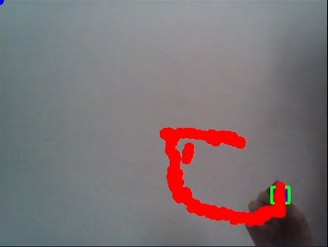

# Virtual Paint using OpenCV

Detects and draws moving objects on a webcam based on their color.

Currently only red and blue pencils are detected.

More colors can be added using **color-calibration.py**

